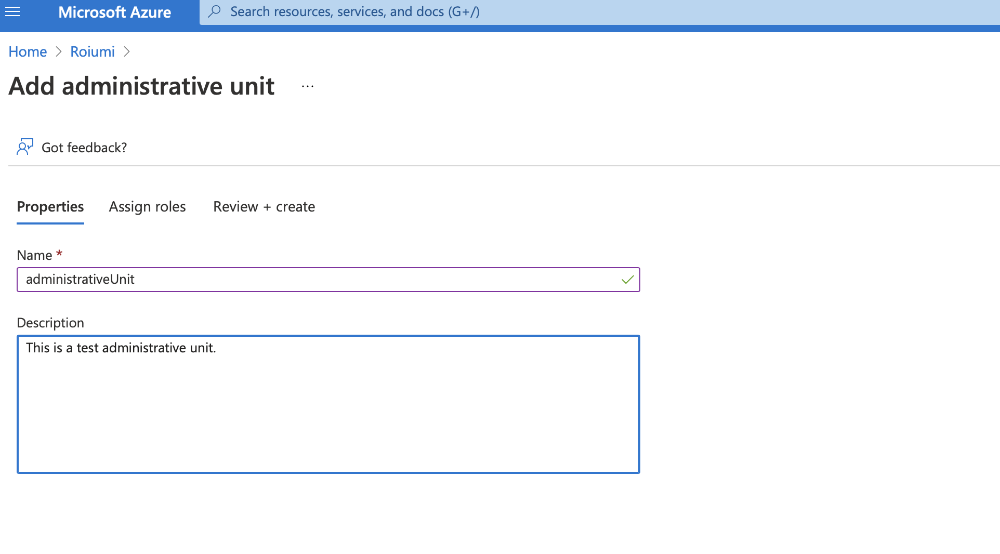
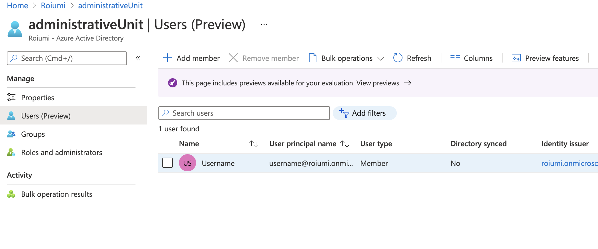
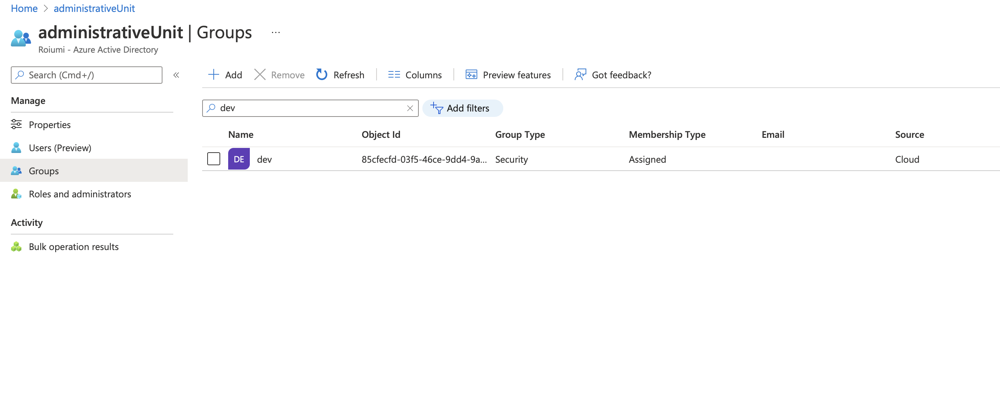

# AZ-104 - Microsoft Azure Administrator
## Manage Azure Identity and Governance
### Manage Azure Active Directory (Azure AD) objects
#### Create administrative units
In Azurea Active Directory (Azure AD) an administrative unit is a resource that can be a container for other Azure AD resources. An administrative unit can contain only users and groups. Administrative units restrict permissions in a role to any portion of your organization that you define. You could user administrative units to delegate the Helpdesk Administrator role to regional support specialist so they can manage user only in the region that they support.
#### Adding an administravie unit
- You can create an administrative unit in the Portal or with Power Shell
1. Create Administrative Units in the Portal

2. Create Administrative Units with PowerShell
`New-AzureADMSAdministrativeUnit -Description "West Coast region" -DisplayName "West Coast"`

#### Adding users to administrative units
- You can add users to administrative units for a more granular administrative scope of control. You can assign users individually or as a bulk operation.
1. Adding users and groups to Administrative units from portal

2. Adding users from powerShell

``
-