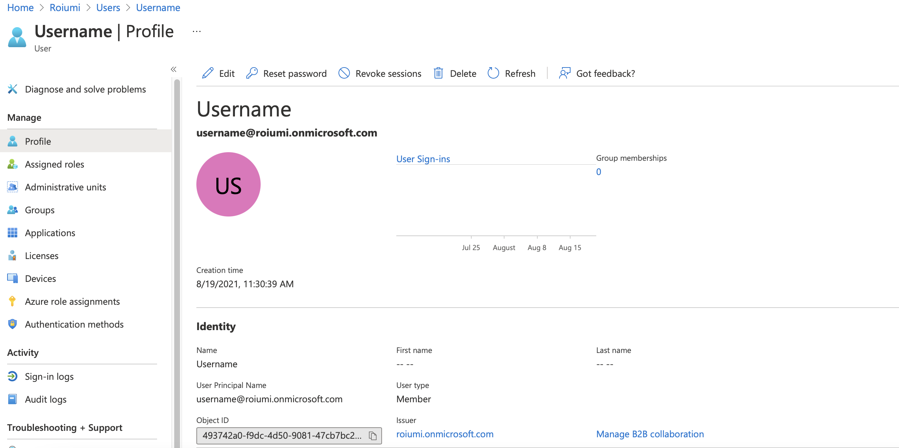

# AZ-104 - Microsoft Azure Administrator
## Manage Azure Identity and Governance
### Manage Azure Active Directory (Azure AD) objects
#### Create users and groups

- Create users in Azure Active Directory
- Understand different types of groups
- Create a group and add members
- Manage business-to-business guest accounts

In Azure Active Directory (Azure AD), all the user accounts are granted a set o default permissions. A user's account access consists of the type of user, their role assignments and their ownership of individual objects.  

There are different types of user accounts in Azure AD. Each type as a level of access specific to the scope of work expected to be done udner each type of user account. Administrators have the highest level of access, followed by the member user accounts in the Azure AD orgranization. Guests users have the most restricted level of access.

#### Permissions and roles 
Azure AD uses permissions to help you control the access rights a user or group is granted. This is done trhough roles. Azure AD has many roles with different permissions attached to them. When a user is assigned a specific role, they inherit permissions from that role.

#### Administrator roles
Administrator roles in Azure AD allow users elevated access to control who is allowed to do what. You assign these roles to a limited group of users to manage identity tasks in Azure AD organization. You can assign administrator roles that allow a user to create or edit users, assign administative roles to others, reset user passwords, manage user licenses and more.  
If a user account has the User Administator or Global Administrator role, you can create a new user in Azure AD by using:  
1. Azure portal
2. Azure CLI :  `az ad user crete`
3. PowerShell: `aNew-AzureADUser`

#### Member users
A member user account is a native member of the Azure AD organization that has a set of default permissions like being able to manage their profile information. When someone new joins you organization, they typically have this type of account created for them. Who is not a guest user, or administratorive role is a member user. This users should not be able to manage other users (create or delete users).

#### Guest users
Guest users have restricted Azure AD organization permissions. When you invite someone to collaborate with your organization, you add them to you Azure AD organization as a guest user.They can eiger send an invitation email that contains a redemptionlink or send a direct link to an app you want to share. Guest users sign in with their own work identities. By default, Azure AD members users can invite guest users. When working with an external partner, the partners will have guet user accounts. Then ensure that the partners have the right level o access to do their work without a higher level of access that they need.

# Add user accounts
- Azure CLI ` az ad user create`
- PowerShell `New-AzureADUser`
* Bulk Create
You can bulk create member users and guest accounts. 
- PowerShell:

# Delete User accounts
- Azure CLI `az ad user delete`
- PowerShell `Remove-AzureADUSer`  
When deleting a user, the account remains in a suspened state for *30 days* and during that period it can be restored.

#### Exercise:
You need to add member user account for the new developer team in your ogranization. Create a new Azure Active Directory (Azure AD) organization to hold all of your user accounte, create a user account, delete a user account and recover a deleted user account. 

https://docs.microsoft.com/en-us/learn/modules/create-users-and-groups-in-azure-active-directory/5-exercise-assign-users-azure-ad-groups  

First you have to create a new tenenat. In this case we created the `roiumi` tenant. 
 
After creating a tenant, we can add users to that tenant. In this case we will add user `username`.  
  
Users can be deleted as shown below  
  
Deleted users can be restored in 30 days after deletion.  
  